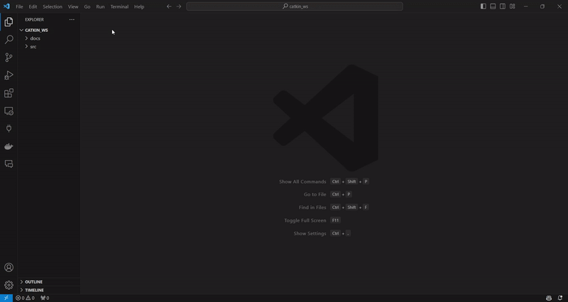
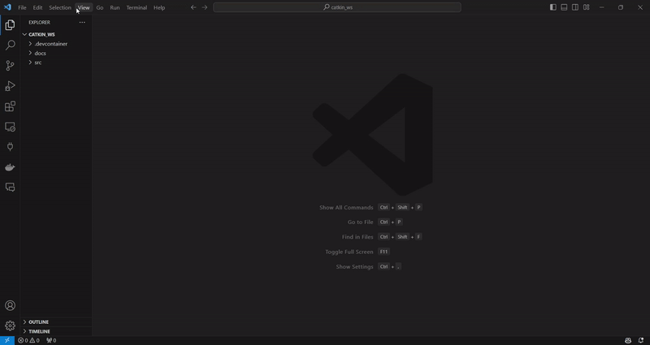
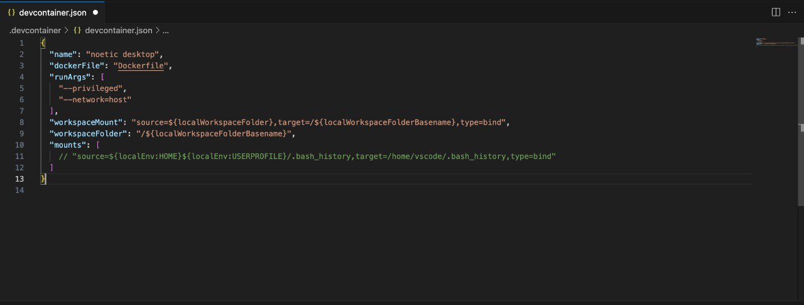
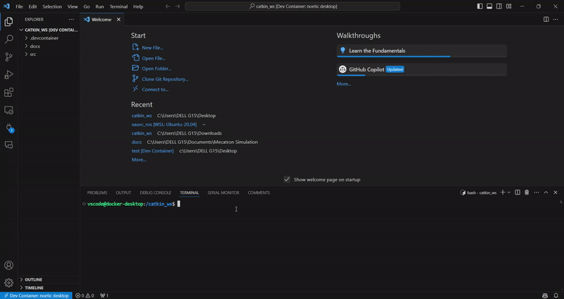
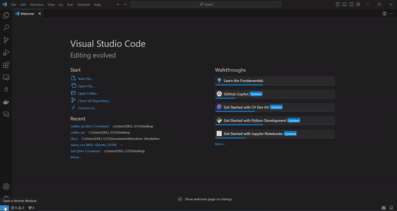
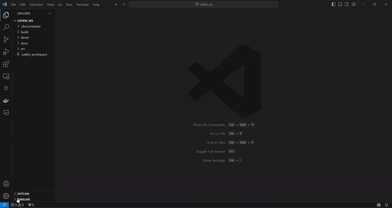
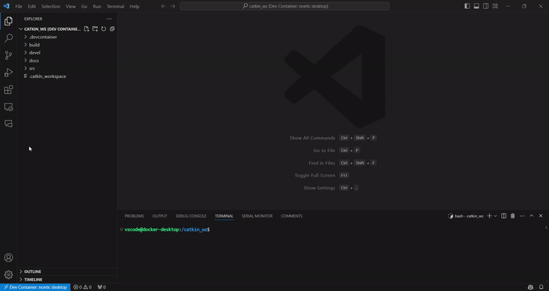
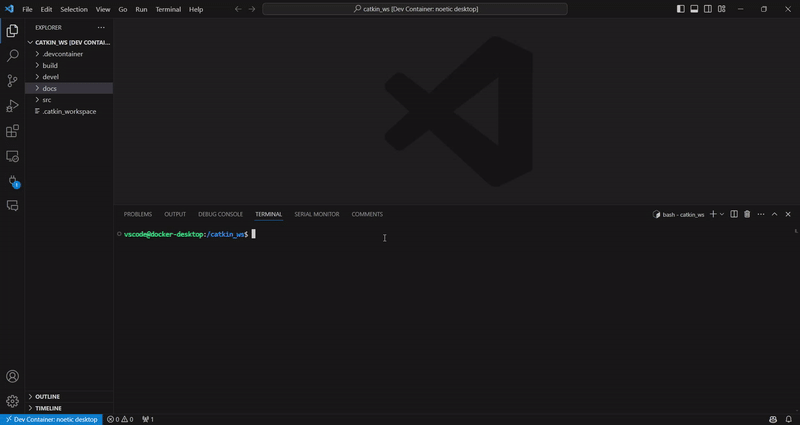

# Getting started with Dev Containers

This tutorial will guide you through the process of running ROS in a Docker container. This is useful for running ROS on systems that do not natively support ROS, or for isolating your ROS installation from your system's installation.

With this method, you can develop on any ROS platforms without any installation. You can also share your workspace with others without worrying about compatibility issues.

For a more detailed guide, you can refer to the official documentation [here](https://code.visualstudio.com/docs/devcontainers/containers).

***Table of Contents***
- [Docker tutorial for running ROS](#docker-tutorial-for-running-ros)
    - [Step 1: Install Docker](#step-1-install-docker)
    - [Step 2: Install VSCode and Remote Development Extension](#step-2-install-vscode-and-remote-development-extension)
    - [Step 3: Add Dev Container Configuration Files and Build the Container](#step-3-add-dev-container-configuration-files-and-build-the-container)
    - [Step 4: Create the workspace](#step-4-create-the-workspace)
- [Working with containers](#working-with-containers)
    - [Resume your container](#resume-your-container)
    - [Install packages](#install-packages)
    - [Edit your devcontainer files](#edit-your-devcontainer-files)
    - [Port forwarding](#port-forwarding)
    - [Automate bashrc](#automate-bashrc)
- [Running GUI applications](#running-gui-applications)
    - [Windows](#windows)
    - [Linux](#linux)
    - [Mac](#mac)

## Docker tutorial for running ROS

### Step 1: Install Docker 

If you are on Windows, you also need to install WSL2. You can find instructions [here](https://learn.microsoft.com/en-us/windows/wsl/install).

### Step 2: Install VSCode and Remote Development Extension

Open Extensions in VSCode from the left sidebar and search for `Remote Development`. Install the extension.

### Step 3: Add Dev Container Configuration Files and Build the Container

`Ctrl + Shift + P` -> `Dev Containers: Add Development Container Configuration Files...` -> `Add configuration to workspace` -> Search `ROS` (select `Show All Definitions` if ROS does not appear yet) -> `ROS (ijnek)` -> `noetic` -> `desktop` -> Press OK or enter all the way through.

   

This will create a `.devcontainer` folder in your workspace with the necessary configuration files. You can now build the container by pressing `Ctrl + Shift + P` and selecting `Dev Containers: Rebuild and Reopen in Container`.



> Tip: you can select option "Rebuild and Reopen in container" straight away, instead of manually adding and reopen step by step, if you do not intend to modify the configuration files.

>> Warning! If you are on MacOS with arm-based chip, you must install Rosetta 2 before building the container. You can do this by running `softwareupdate --install-rosetta` in the terminal.

> Note: If you are using Mac, you will need to comment out the mount line to avoid mount error when building the dev container.



### Step 4: Create the workspace

Make sure that your folder has a `src` folder with your ROS packages. You can also install your ros packages later.

```bash
catkin_make
```



Voila! You are now running ROS in a Docker container. You can now run your ROS nodes as you would normally.

## Working with containers

### Resume your container

When you open a new VS Code window, you will see a list of recent tabs. Assuming your workspace name is `catkin_ws`, you can click on the `catkin_ws [Dev Container]` tab to resume your container.



If you happen to open the workspace without the container, you can always click on the blue icon at the bottom left corner of the window and select `Reopen in Container`.



### Install packages

Before you can install any packages, you need to update the package list.

```bash
sudo apt update
```

You can then install packages as you would normally.

```bash
sudo apt install -y vim
```

### Edit your devcontainer files

You can edit the `devcontainer.json` and `Dockerfile` files to customize your container. Editing the `devcontainer.json` file will allow you to change the settings of your container, such as the runtime arguments, the display, and the port forwarding. Editing the `Dockerfile` file will allow you to change the packages that are installed in your container.

For example, you can add the following line to the `Dockerfile` to install the some common packages:

```Dockerfile
RUN apt-get update \
    && apt-get install -y git \
    python3-pip \
    vim \
    nano \
    net-tools \
    python3-opencv \
    wget \
    && rm -rf /var/lib/apt/lists/*
```

Whenever you modify the `devcontainer.json` file or `Dockerfile`, you need to rebuild the container to apply the changes.

> Note: You must add these lines before setting the `USER` to non-root in Dockerfile, otherwise you will run into permission issue.

> Warning: Adding these lines will increase the build time of the container significantly (up to 10 minutes).

### Port forwarding

You can forward ports from your container to your host machine by [editing the json file](https://code.visualstudio.com/docs/devcontainers/containers#_forwarding-or-publishing-a-port) and rebuild the container.

However, you are recommended to forward the ports when you are already in the container. Right click on the left sidebar and select `Port`. From there you can add as many ports as your applications need.



### Automate bashrc

You can automate the sourcing of the workspace by running this in the command line once.

```bash
echo "source /catkin_ws/devel/setup.bash" >> ~/.bashrc
```

## Running GUI applications

### Windows

> Note: Sometimes, GUI works even without X server installation and we are not very sure why. You can try running GUI applications without X server installation first. If it fails, you can proceed to install X server.

If you are on Windows, you need to install an X server. We recommend [Xming](https://sourceforge.net/projects/xming/). Make sure to run it before starting the container. Click Next/OK all the way through the start-up wizard.

After this, you can try to run rviz.

```bash
# Open one terminal
roscore

# Open another terminal
rviz
```



### Linux

X server is pre-installed in Linux. However, you need to enable X11 forwarding if it is not already enabled. Type in terminal `sudo vim /etc/ssh/sshd_config` and uncomment the line `X11Forwarding yes`. Save the document by typing `esc` followed by `:wq`. Restart the ssh service by typing `sudo service ssh restart`.

Rviz should run as expected.

### Mac

Good luck for now:>! We are still figuring out how to run GUI applications on Mac. If you have any suggestions, please let us know.
